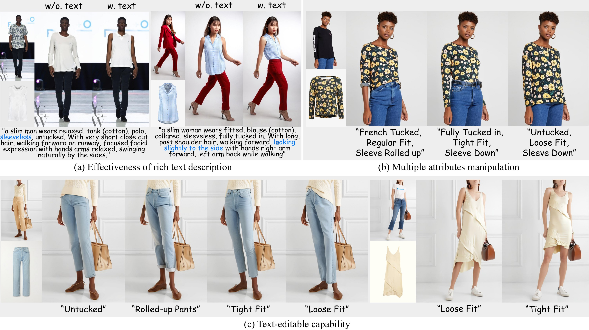

# PromptDresser: Improving the Quality and Controllability of Virtual Try-On via Generative Textual Prompt and Prompt-aware Mask
This repository is the official implementation of [PromptDresser](TODO: arXiv link)

> **PromptDresser: Improving the Quality and Controllability of Virtual Try-On via Generative Textual Prompt and Prompt-aware Mask**<br>
> [Jeongho Kim](https://scholar.google.co.kr/citations?user=4SCCBFwAAAAJ&hl=ko), [Hoiyeong Jin](https://scholar.google.com/citations?user=Jp-zhtUAAAAJ&hl=en), [Sunghyun Park](https://psh01087.github.io/), [Jaegul Choo](https://sites.google.com/site/jaegulchoo/)

[[arXiv Paper](TODO: arXiv link)]&nbsp;

&nbsp;

## TODO List
- [v] ~~Inference code~~
- [v] ~~Release model weights~~
- [] Training code

## Environments
```bash
git clone https://github.com/rlawjdghek/PromptDresser
cd PromptDresser

conda create --name PromptDresser python=3.10 -y
conda activate PromptDresser

# install packages
pip install torch==2.1.0 torchvision==0.16.0 torchaudio==2.1.0 --index-url https://download.pytorch.org/whl/cu121
python -m pip install diffusers==0.25.0
python -m pip install accelerate==0.31.0
python -m pip install transformers>=4.25.1
python -m pip install ftfy
python -m pip install Jinja2
python -m pip install datasets
python -m pip install wandb
python -m pip install onnxruntime-gpu==1.19.2
python -m pip install omegaconf
python -m pip install einops
python -m pip install torchmetrics
python -m pip install clean-fid
python -m pip install scikit-image

python -m pip install opencv-python
python -m pip install fvcore
python -m pip install cloudpickle
python -m pip install pycocotools
python -m pip install av
python -m pip install scipy
python -m pip install peft

python -m pip install huggingface-hub==0.24.6
```

## Weights and Data
First, download the [sdxl](https://huggingface.co/stabilityai/stable-diffusion-xl-base-1.0) and [sdxl inpainting](https://huggingface.co/diffusers/stable-diffusion-xl-1.0-inpainting-0.1) models into the pretrained_models folder using Git LFS. <br>
[Human parsing model](https://kaistackr-my.sharepoint.com/:u:/g/personal/rlawjdghek_kaist_ac_kr/Ee3dZA1XHdRItvC4vo7FkNYBS5UnAo121InZa6F6FFpbfQ?e=bGoRsU) and our [checkpoint](https://kaistackr-my.sharepoint.com/:f:/g/personal/rlawjdghek_kaist_ac_kr/EgSQrdvWmgNElCo62CId3_4BA4UwFLRhmNnzWUGb04ZClQ?e=lSh06b) on VITONHD should be placed in the checkpoints folder. <br>

You can download the VITON-HD dataset from [here](https://github.com/shadow2496/VITON-HD), and download text file and two agnostic mask for prompt-aware mask generation from [here](https://kaistackr-my.sharepoint.com/:f:/g/personal/rlawjdghek_kaist_ac_kr/EroBlORglNBPuAzf21-A9csBW-qoPr-kgG414aHJE7gwgQ?e=CoQTEc). <br>
For the inference, the following dataset structure is required:

```
test_coarse
|-- image
|-- image-densepose
|-- agnostic-mask
|-- cloth
...

test_fine
|-- image
|-- image-densepose
|-- agnostic-mask
|-- cloth
...

test_pairs.txt
test_unpairs.txt
test_gpt4o.json
```

## Inference
```bash
#### single gpu
CUDA_VISIBLE_DEVICES=0 python inference.py \
 --config_p "./configs/VITONHD.yaml" \
 --pretrained_unet_path "./checkpoints/VITONHD/model/pytorch_model.bin" \
 --save_name VITONHD

#### multi-gpu
CUDA_VISIBLE_DEVICES=0,1,2,3 accelerate launch --mixed_precision fp16 --num_processes 4 --multi_gpu inference.py \
 --config_p "./configs/VITONHD.yaml" \
 --pretrained_unet_path "./checkpoints/VITONHD/model/pytorch_model.bin" \
 --save_name VITONHD
```


## Citation
If you find our work useful for your research, please cite us:
```
TODO: arxiv citation
```

## License
Licensed under the CC BY-NC-SA 4.0 license (https://creativecommons.org/licenses/by-nc-sa/4.0/legalcode).
